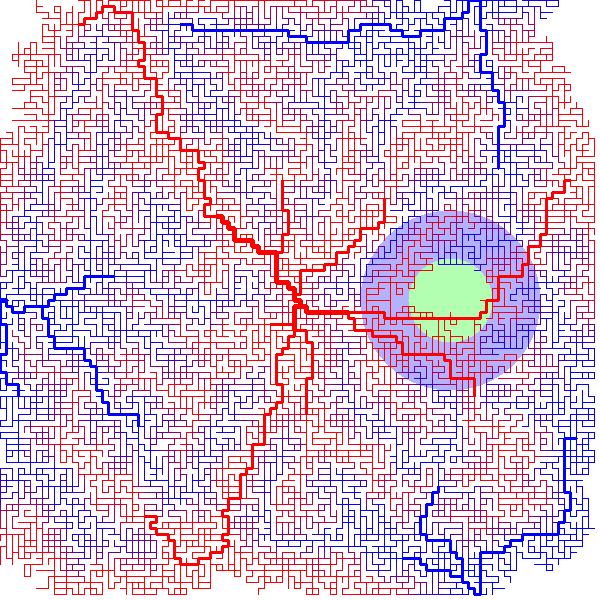

# insilico-perfusion

## Installation
```
python setup.py install
```

## Examples

### Create and optimize a vessel network
```
python examples/createVascularization.py
```


**Fig. 1.** Showing how the vascular network evolves during optimization. The blue region mimics the necrotic core of a tumor, where the probability of vessel sprouting is reduced.  


### Run perfusion simulation on vessel network
```
python examples/calcPerfusion.py
```



**Fig. 2.** The vascular network used for the marker perfusion simulation. The blue region mimics a tumor with increased marker permeability.


**Fig. 3.** Showing how the concentration of an injected marker chamges over time in different parts of the tissue. *left:* The marker concentration only considering the plasma. *center:* The marker concentration in the interstitial space. *right:* The total marker concentration.  
